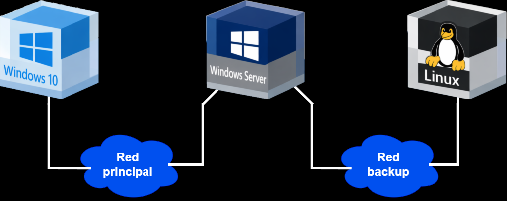

# 🛡️ Sistema de Copias de Seguridad frente a Ataques Ransomware

> Diseño e implementación de un laboratorio virtualizado para proteger una infraestructura empresarial frente a ataques ransomware mediante una estrategia de copias de seguridad basada en **Veeam Backup & Replication** y un **repositorio Linux endurecido (Hardened Repository)** con almacenamiento inmutable.

---

## 📑 Índice

- 📖 Descripción
- 🎯 Objetivos
- 🏗️ Arquitectura
- 🖥️ Infraestructura
- ⚙️ Funcionamiento del laboratorio
- 🔒 Protección del repositorio
- 💣 Simulación del ataque
- 📊 Resultados
- ⚠️ Limitaciones
- 🚀 Mejoras futuras
- 📷 Capturas
- 📄 Documentación
- 🎥 Demostración
- 👨‍💻 Autor

---

# 📖 Descripción

Este proyecto corresponde a mi **Trabajo de Fin de Grado (TFG)** del ciclo formativo de **Administración de Sistemas Informáticos en Red (ASIR)**.

Consiste en el diseño e implementación de un laboratorio empresarial virtualizado para evaluar la protección frente a ataques ransomware mediante un sistema de copias de seguridad basado en **Veeam Backup & Replication** y un **repositorio Linux Hardened Repository** con inmutabilidad.

El objetivo principal es demostrar que, incluso tras un ataque ransomware que cifra la información de una organización, es posible recuperar los datos de forma rápida, íntegra y segura gracias a una estrategia de copias de seguridad correctamente diseñada.

Todo el laboratorio se ha desplegado sobre un entorno virtualizado con el fin de simular una infraestructura empresarial real.

---

# 🎯 Objetivos

- Diseñar una infraestructura empresarial virtualizada.
- Implementar un sistema de copias de seguridad con Veeam Backup & Replication.
- Configurar un repositorio Linux Hardened Repository con inmutabilidad.
- Automatizar la ejecución de las copias de seguridad.
- Simular un ataque ransomware controlado.
- Restaurar los datos afectados.
- Evaluar los objetivos de recuperación (**RTO**) y pérdida de datos (**RPO**).
- Analizar la resiliencia del sistema frente al ransomware.

---

# 🏗️ Arquitectura

---

# 🖥️ Infraestructura

| Equipo | Función |
|--------|---------|
| Windows Server | Servidor de almacenamiento de datos con el software de backup (Veeam Backup & Replication) |
| Ubuntu Server | Repositorio inmutable de copias de seguridad |
| Cliente Windows | Equipo de un empleado donde se simula el ataque ransomware |

---

# ⚙️ Funcionamiento del laboratorio

El laboratorio reproduce un entorno empresarial simplificado:

1. Los usuarios almacenan información en una carpeta compartida del servidor.
2. Veeam ejecuta copias de seguridad automáticas.
3. Las copias se almacenan en un repositorio Linux con inmutabilidad.
4. Se simula un ataque ransomware sobre el equipo cliente.
5. Los archivos compartidos quedan cifrados.
6. Se restauran los datos desde Veeam.
7. Se verifica la integridad de la información recuperada.

---

# 🔒 Protección del repositorio

El repositorio Linux implementa las principales medidas de protección recomendadas por Veeam:

- Linux Hardened Repository.
- Sistema de archivos XFS.
- Fast Clone.
- Backups inmutables durante 7 días.
- Usuario dedicado sin privilegios administrativos.

Gracias a estas medidas, las copias de seguridad permanecen protegidas incluso si un atacante compromete el servidor principal.

---

# 💣 Simulación del ataque

Para evitar utilizar malware real, se desarrolló un script propio que reproduce el comportamiento básico de un ransomware.

El script realiza las siguientes acciones:

- Localiza los archivos objetivo.
- Cifra su contenido mediante AES.
- Elimina los archivos originales.
- Genera los archivos cifrados.
- Crea una nota de rescate.

Posteriormente se ejecuta el proceso completo de recuperación mediante Veeam Backup & Replication para verificar que los datos pueden restaurarse correctamente.

---

# 📊 Resultados

Durante las pruebas se verificó correctamente:

- ✅ Restauración completa de los datos tras el ataque.
- ✅ Funcionamiento del repositorio inmutable.
- ✅ Recuperación satisfactoria de la infraestructura.
- ✅ Cumplimiento de los objetivos de recuperación.

| Métrica | Objetivo | Resultado |
|---------|---------:|---------:|
| RTO | 30 minutos | ~8 minutos |
| RPO | 24 horas | 0 horas |

---

# ⚠️ Limitaciones

Debido a las limitaciones del hardware disponible, el laboratorio protege únicamente una carpeta compartida.

En un entorno empresarial real la solución podría ampliarse para proteger:

- Máquinas virtuales completas.
- Servidores físicos.
- Bases de datos.
- Aplicaciones críticas.

---

# 🚀 Mejoras futuras

- Implementación de la estrategia 3-2-1-1-0.
- Copias de seguridad en la nube.
- Integración con almacenamiento NAS.
- Repositorio secundario.
- Firewall dedicado entre redes.
- MFA para el acceso administrativo.
- Monitorización y alertas.
- Restauración de máquinas virtuales completas.

---

# 📷 Capturas

> *(Aquí se añadirán capturas del laboratorio.)*

- Arquitectura.
- VMware Workstation.
- Consola de Veeam.
- Linux Hardened Repository.
- Trabajos de backup.
- Simulación del ransomware.
- Restauración de datos.

---

# 📄 Documentación

📥 **[Memoria completa del TFG](resources/Memoria_TFG.pdf)**

---

# 🎥 Demostración

▶️ **[Ver vídeo de la demostración]([https://www.youtube.com/watch?v=tKG0CFNP9UI])**

---

# 👨‍💻 Autor

**Iván Ruiz García**

Técnico Superior en Administración de Sistemas Informáticos en Red (ASIR)

- 💼 LinkedIn: https://linkedin.com/in/ivanruizhellin
- 🐙 GitHub: https://github.com/ivanruizhellin
